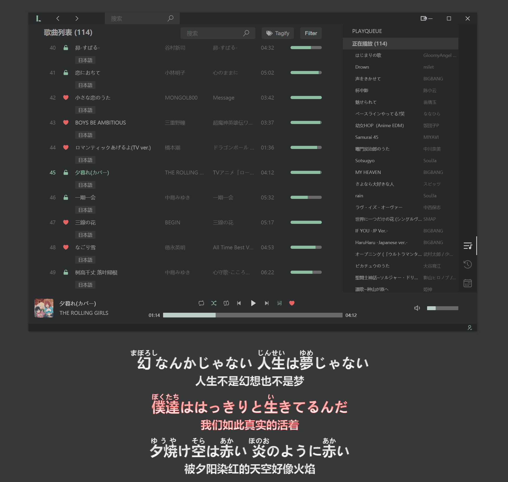

> 为了更好地听音乐。

## 特性

### 权重（WIP）

由于用户对于不同歌曲的喜爱程度不同，虽然它们都出现在「我喜欢的音乐」中，但明显应该占有不同的权重，而这些权重是可以通过用户反馈不断修正的（比如切换到单曲循环，增大音量等）。

对于大歌单，引入权重的优势是明显的，用户将更容易听到自己想听到的。

### 标签

标签比歌单更加灵活，在标签系统下，你可以通过组合标签进行自定义地筛选你想要听的歌曲。

不止如此，Lunar 还支持自动为歌单中的歌曲生成标签（目前仅支持常见语种）。

### 桌面歌词

当听到那些让你共情的歌曲，难免会想跟着哼几句，而这个时候忘记歌词是尴尬的。

庆幸的是，Lunar 提供了体验良好的桌面歌词。

### 注音

为了帮助那些想了解，或掌握歌词正确发音的用户，Lunar 将歌词注音提供为附加功能（目前仅支持日语）。

## 感谢

- [网易云音乐](https://music.163.com)
- [microsoft/vscode](https://github.com/microsoft/vscode)
- [Binaryify/NeteaseCloudMusicApi](https://github.com/Binaryify/NeteaseCloudMusicApi)
- [nondanee/UnblockNeteaseMusic](https://github.com/nondanee/UnblockNeteaseMusic)
- [hexenq/kuroshiro](https://github.com/hexenq/kuroshiro)

## License

MIT
